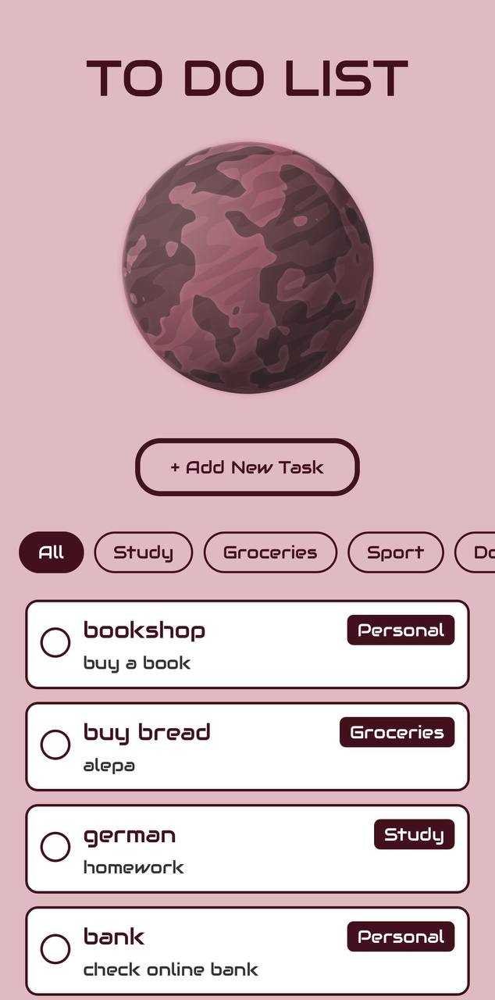
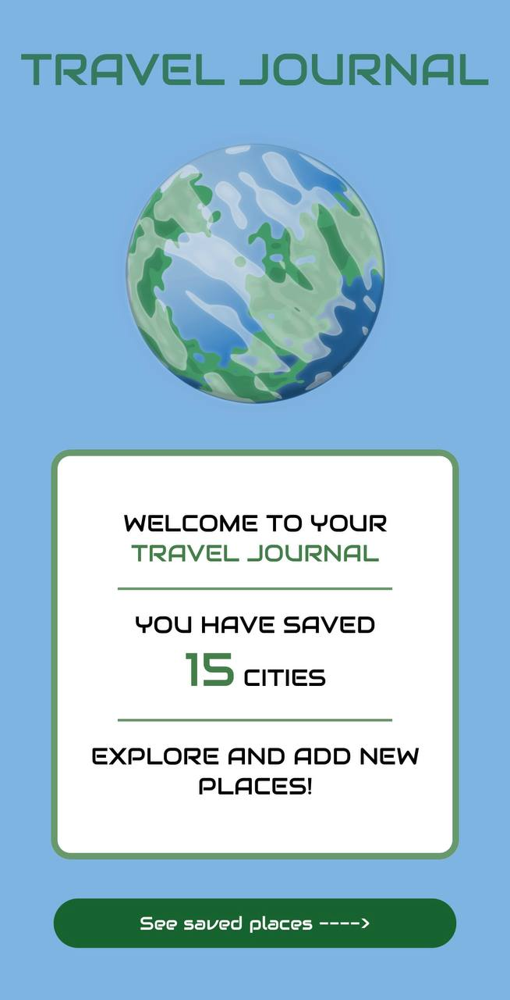
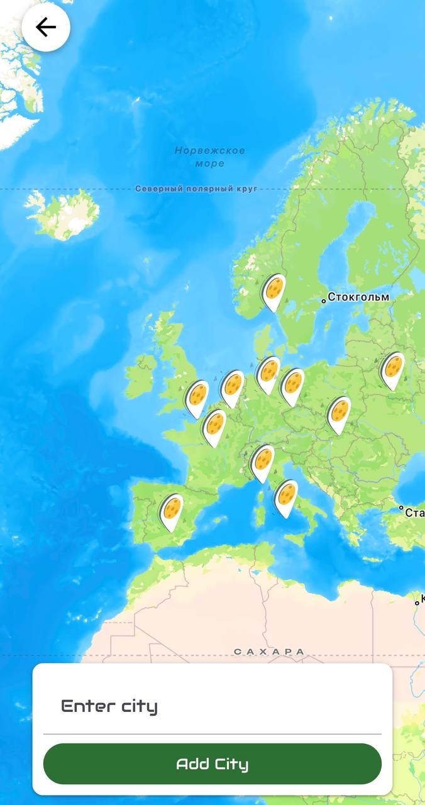
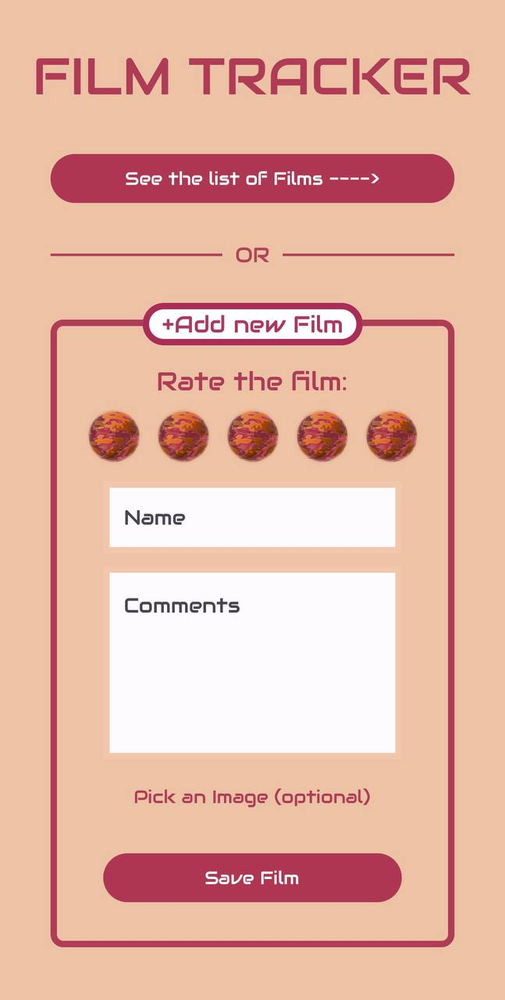
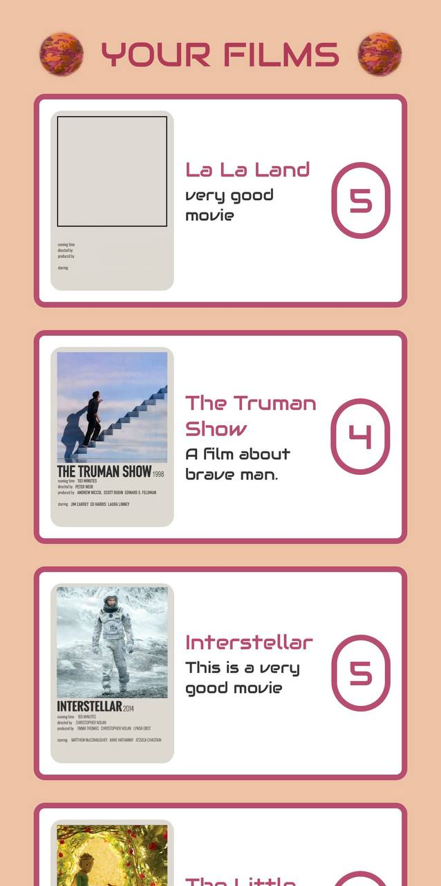
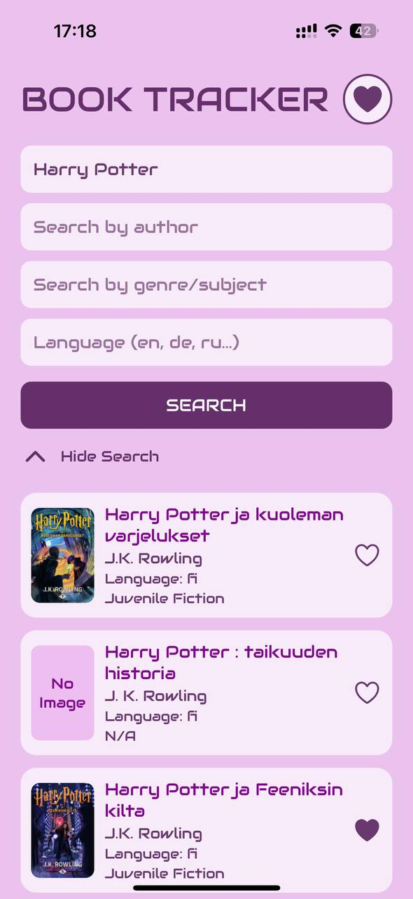
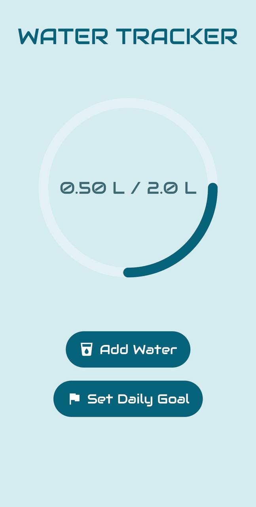

# Orbit App 

## Orbit - an app for the daily use, where you can find differenr sections to track your hobbies and habits.

## 🔧 Technologies

```bash
💻 JavaScript  
⚛️ React  
🧩 React Native
🌀 React Native Paper  
🔥 Firebase Realtime Database  
🚀 Expo
```

## 📂 Project Structure

```bash
app/
├── screens/ # all the screens are under this folder
└── index.js # the main screen/onboarding

assets/
├── icons/ # icons that are used in the screens
└── images/ # all the images used in the screens
```

## 📱 Sections/Screens

Explanation of core features of each section/screen and its functionality.

---
<div style="display: flex; align-items: flex-start; gap: 20px;">

<div>

# To Do List 

## On this screen the user can track his/her tasks/notes.

---

### ⭐ Core Features

- Add tasks with name, description, and category

- Filter tasks by category or show all

- Mark tasks as completed (auto-delete with visual feedback)

- Persistent storage with Firebase Realtime Database

- Modal form for adding tasks

- Custom fonts and styled task list

</div>



</div>

---

<div style="display: flex; align-items: flex-start; gap: 20px;">

<div>

# Travel Journal 

## On this screen user can add cities where he/she was, see them on the map and see the total number of cities.

---

### ⭐ Core Features

- View saved cities — shows total number of cities visited

- Real-time data — loads saved cities from Firebase Realtime Database

- Map integration — displays all saved cities with markers

- Add new city — search and add cities with geolocation and reverse geocoding

- Zoom to city — tap marker to zoom in on its location

- Callouts — marker shows city and country info

- Back navigation — return to main screen easily

- Animated input card — adjusts position with keyboard

- Custom fonts and styled UI — uses Audiowide font and themed cards/buttons

</div>





</div>

---

<div style="display: flex; align-items: flex-start; gap: 20px;">

<div>

# Film Tracker 

## On this screen the user can add the films and see the list of his/her films.

---

### ⭐ Core Features

- Add new films — name, rating (0–5), comments, optional image

- Image picker — select a film poster from gallery

- Real-time database — save and load films with Firebase Realtime Database

- Film list view — shows all saved films with image, name, comments, and rating

- Rating visualization — interactive star-like rating with border highlight

- Keyboard-friendly form — input adjusts with keyboard (iOS/Android)

- Custom fonts and styled UI — uses Audiowide font, themed cards, buttons, and borders

- Navigation — easily switch between add film form and list of films

</div>





</div>

---

<div style="display: flex; align-items: flex-start; gap: 20px;">

<div>

# Book Tracker 

## On this screen the user can search for a book and add it to the "Favorite Books" list.

---

### ⭐ Core Features

- Search books via Google Books API — filter by title, author, genre/subject, and language

- Dynamic results — displays books with title, authors, language, category, and thumbnail

- Save favorites — mark books as saved (heart icon) and store in Firebase Realtime Database

- Saved books view — list of all saved books with remove functionality

- Responsive UI — cards with images, fallback “No Image” placeholders

- Animated search panel — hide/show inputs smoothly

- Keyboard-friendly input — closes keyboard on tap outside

- Custom fonts & themed UI — uses Audiowide font, styled buttons, inputs, and cards

- Real-time sync — updates saved state instantly when books are added/removed

</div>




</div>

---

<div style="display: flex; align-items: flex-start; gap: 20px;">

<div>

# Water Tracker 

## On this screen user can track the amount of water he/she drinks during the day and set a goal.

---

### ⭐ Core Features

- Daily water tracking — log water intake in milliliters or liters

- Custom daily goal — set and update your hydration goal, saved in Firebase Realtime Database

- Animated progress circle — visual representation of daily intake with smooth animation

- Add water quickly — predefined buttons (+250 ml, +500 ml, +1 L) for fast logging

- Congratulations modal — celebrates when daily goal is reached with icons and message

- Persistent data — keeps daily water intake and goal synced in real-time with Firebase

- Responsive and styled UI — cards, modals, buttons with Audiowide font

- Loading indicator — shows while fetching data from Firebase

</div>



</div>

---

## 🛠️ Installation

1. Clone the repository

```bash
git clone <YOUR_REPOSITORY_URL>
cd orbit-app
```

2. Install dependencies

```bash
npm install
# or
yarn install
```

3. Configure Firebase (if needed)

- Create a Firebase project and Realtime Database.

- Add **firebaseConfig.js** in the project root:

```js
import { initializeApp } from "firebase/app";
import { getDatabase } from "firebase/database";

const firebaseConfig = {
  apiKey: "YOUR_API_KEY",
  authDomain: "YOUR_PROJECT_ID.firebaseapp.com",
  databaseURL: "https://YOUR_PROJECT_ID-default-rtdb.firebaseio.com",
  projectId: "YOUR_PROJECT_ID",
  storageBucket: "YOUR_PROJECT_ID.appspot.com",
  messagingSenderId: "YOUR_SENDER_ID",
  appId: "YOUR_APP_ID"
};

const app = initializeApp(firebaseConfig);
export const db = getDatabase(app);
```

4. Add Google Books API key

- Create a **.env** file in the project root and add your API key:

```env
GOOGLE_BOOKS_API_KEY=your_api_key_here
```

5. Run the app

```bash
npx expo start #--tunnel
```

Open in **Expo Go** or in an **emulator** to start using the app.

---

## 🌟 Future Plans

- 📅 Calendar View – See all tasks and filter by category.

- 😊 Mood Journal – Track daily moods and feelings.

- 💳 Expense Tracker – Manage and track your expenses.

- 🔐 Authentication – User login and security features.

- 🌙 Dark Mode – Enable a dark theme for the app.

…and more … 🚀

---

## 📄 Licenses & Attributions

### All the information (licenses) about assets I used is on the **About App** screen.

- **Google Fonts – Audiowide:** SIL Open Font License 1.1

- **Planets 2D Assets (Kenney):** Free for personal & commercial use

- **Map Marker & Start Button Icons (Flaticon):** Free with attribution

- **Images from Pinterest:** Non-commercial, educational, prototype use only

- **Google Books API:** Usage governed by Google APIs Terms of Service

---

## 🧚 Author

✦ Alisa Ermel ✦

---

© 2025 Alisa Ermel. All rights reserved.